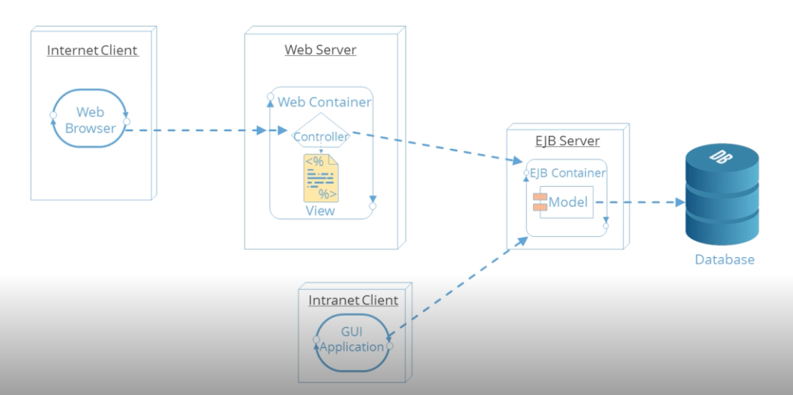
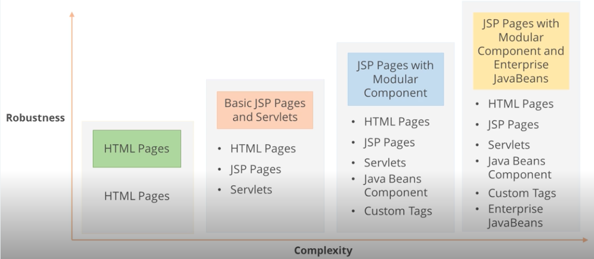
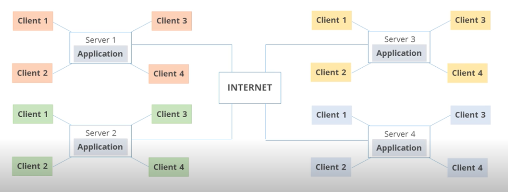
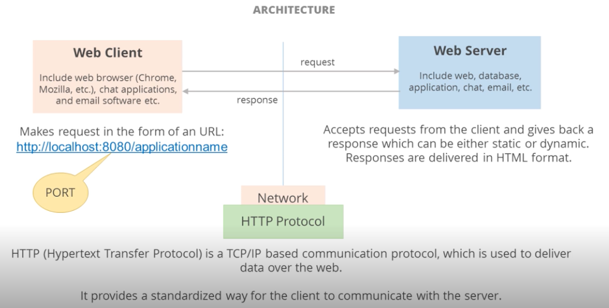
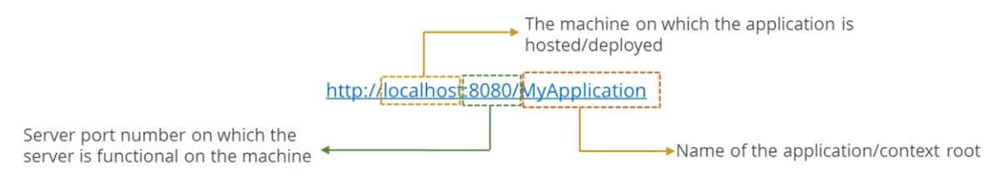
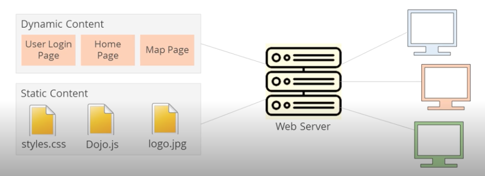
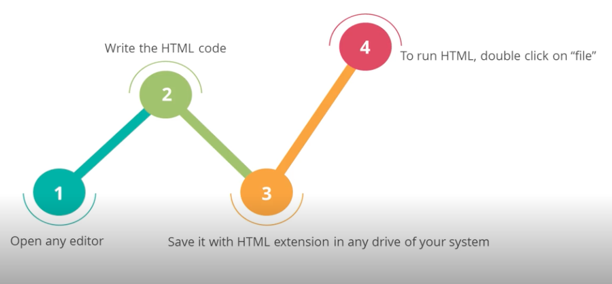
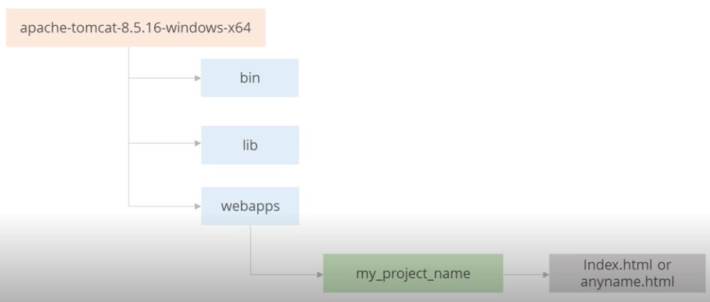

# Introduction to JAVA EE

[](https://www.java.com/en/)

## TOC

- [Introduction to JAVA EE](#introduction-to-java-ee)
  - [TOC](#toc)
  - [Abbreviations](#abbreviations)
  - [Introduction to Java EE](#introduction-to-java-ee-1)
    - [Java Editions](#java-editions)
      - [Features of Java SE (Standard Edition)](#features-of-java-se-standard-edition)
      - [Features of Java EE (Enterprise Edition)](#features-of-java-ee-enterprise-edition)
      - [Features of Java ME (Micro Edition)](#features-of-java-me-micro-edition)
    - [Java EE vs. Java SE](#java-ee-vs-java-se)
    - [Java EE Libraries and APIs](#java-ee-libraries-and-apis)
    - [Java EE Architecture](#java-ee-architecture)
      - [Java EE Architecture: Features](#java-ee-architecture-features)
      - [Relating Java EE Architecture Complexity and Robustness](#relating-java-ee-architecture-complexity-and-robustness)
    - [Distributed Applications and Client-Server Model](#distributed-applications-and-client-server-model)
      - [Distributed Applications](#distributed-applications)
      - [Client-Server Model](#client-server-model)
        - [Definition](#definition)
        - [Architecture](#architecture)
        - [Significance of URL and Port](#significance-of-url-and-port)
        - [Features of the HTTP Protocol](#features-of-the-http-protocol)
        - [Server Response](#server-response)
        - [Server Response Types](#server-response-types)
        - [Types of Servers](#types-of-servers)
        - [Web Server vs. Application Server](#web-server-vs-application-server)
        - [Client Request Types](#client-request-types)
        - [Server Response: HTML](#server-response-html)
        - [Server Response: HTML Document Structure](#server-response-html-document-structure)
        - [Server Response: Running and HTML Code](#server-response-running-and-html-code)
      - [Running an HTML Code with Apache](#running-an-html-code-with-apache)
        - [Tomcat Apache Directory Hierarchy](#tomcat-apache-directory-hierarchy)

## Abbreviations

- \*[API]: Application Programming Interface
- \*[EE]: Enterprise Edition
- \*[EJB]: Enterprise Java Business
- \*[HTML]: HyperText Markup Language
- \*[HTTP]: Hypertext Transfer Protocol
- \*[JDBC]: Java Database Connectivity
- \*[JMS]: Java Message Service
- \*[JPA]: Java Presistence API
- \*[JSP]: Java Server Pages
- \*[ME]: Micro Edition
- \*[RMI]: Remote Method Invocation
- \*[SE]: Standard Edition
- \*[TCP/IP]: Transmission Control Protocol/Internet Protocol
- \*[URI]: Uniform Resource Identifier
- \*[URL]: Uniform Resource Locator
- \*[XML]: E**X**tensible Markup Language

## Introduction to Java EE

### Java Editions


#### Features of Java SE (Standard Edition)

- Java SE is the core Java programming platform. It contains all Java libraries
- The latest version id **Java SE 8u131**
- It helps to develop and deploy Java applications on desktops, server, and embedded environments. It is used to build standalone applications

#### Features of Java EE (Enterprise Edition)

- Java EE platform is designed to help developers create large-scale, multi-tiered, scalable, reliable, and secure network applications
- The latest version is **Java EE 7**
- It is portable, so it allows an application hosted at one common place to be accessed by users across the world over the Internet
- It provides API (Application Programming Inteface) to develop **distributed applications** that follows **Client-Server Model**
- If facilitates the development of web applications

#### Features of Java ME (Micro Edition)

- Java ME (Java 2 Platform, Micro Edition) is a technology that allows programmers to develop programs for mobile application devices
- The latest version is **Java ME 8.3**
- If consists of programming specifications and a special virtual machine, the K virtual machine, that allows a Java ME-encoded program to run on mobile devices

### Java EE vs. Java SE

The Java EE differs from Java SE in terms of the libraries it provides to deploy

- fault-tolerant,
- distributed, and
- multi-tier Java software, based largely on modular components running on an application server

### Java EE Libraries and APIs

- Built on top of Java SE, Java EE provides additional libraries for
  - database access [JDBC(Java Database Connectivity), JPA (Java Presistence API)]
  - remote method invocation (RMI)
  - messageing [JMS (Java Message Service)]
  - web services
  - XML (eXtensible Markup Language) processing
- It also defines standard APIs for Enterprise Javabeans, Servlets, Portlets, and Java Server Pages (JSP)

### Java EE Architecture



#### Java EE Architecture: Features

- Java EE platform facilitates an architecture in which the business components are placed in a separate tier
- The Java EE architecture enhances features such as scalability, extensibility, and maintainability
- Its modular design allows easy modification of the business logic. It provides more security because it partitions business services from the web tier. It also permits clean separation of job roles
- The enterprise components can leverage their EJB container for service, such as component and resource management, security, persistence, and transactions

#### Relating Java EE Architecture Complexity and Robustness



- as the richness and robustness of a web application increases, so does the complexity
- the complexity of the application can be managed by proper design that helps in getting rid of programming concerns
- the web container and Java ee platform provide componenets that can be used to manage complex application design

### Distributed Applications and Client-Server Model

> :exclamation: **Recall**:
>
> Java EE provides API to develop **distributed applications** that follows **Client-Server Model**

#### Distributed Applications

- in distributed applications, same application can run across different machines at the same time using internet
- one machine acts as Server where application is deployed and the other machine acts as Client



#### Client-Server Model

##### Definition

Client-Server Model
: A distributed application structure that partitions task or workloads between the providers fo a resource or service (web servers) and service requesters (web clients)

Both **web client** and **web server** are programs

> :notebook: A web client is _not_ a user, but a program. Someone how uses this program to send request to web server is known as "end user"

##### Architecture



##### Significance of URL and Port

URL uniquely identifies a resource on the internet and follows HTTP protocol



> :notebook: Tomcat server runs on port 8080, Remember to check during installation.

##### Features of the HTTP Protocol

- HTTP is a TCP/IP based communication protocol, which is used to deliver data over the web
- This protocol is used to change or transfer the hypertext
- Hypertext is a structure text that uses logical links between containing text
- It is a stateless protocol, it done not require the HTTP server to retain information about each user

##### Server Response

Server generates response for Client request. It sends three things:

1. Status which tells whether client's response has successgully reach the server or not
   1. Ex: 404 - error for page not found
2. Information about the type of content that the server is going to send. The server sends HTML pages as response
3. Actual content
   1. Example: when client [http://www.google.com](http://www.google.com) in any browser, the server navigates the client to the Google home page

##### Server Response Types

- **Static Page**: There is no change in the content. Client requests a web page and server gets the page back as response
- **Dynamic Page**: The page content changes frequently. Server may not be able to process the request



##### Types of Servers

Commonly used server types are as follows:

- Web Server
- Application Server
- Proxy Server
- Virtual Server
- Blade Server
- File Server
- Policy Server

##### Web Server vs. Application Server

|                                                                                               Web Server                                                                                               |                                                                                                                                    Application Server                                                                                                                                    |
| :----------------------------------------------------------------------------------------------------------------------------------------------------------------------------------------------------: | :--------------------------------------------------------------------------------------------------------------------------------------------------------------------------------------------------------------------------------------------------------------------------------------: |
|                                                                                 Web Server program runs on the server                                                                                  |                                                                                                                             It is a component based product                                                                                                                              |
| It looks for incoming requests and services those requests. Once the web server receives a request, depending on teh type of request, ti might look for a web page, or execute a program on the server |                                                                                       It provides middleware services for security and state maintenance, along with data access and persistence.                                                                                        |
|                               Web server have plugins to support scripting languages like Perl, PHP, ASP, JSP etc. through which they can generate dynamic HTTP content.                               | Application Server can do whatever Web Server is capable of doing as it has Web Server as an integral part. Additionally, it has components and features to support Application level services such as Connection Pooling, Object Pooling, Transaction Support, Messaging services, etc. |
|                                                                           It acts as a container which serves static content                                                                           |                                                                                                                 It acts as container upon which business logic is built                                                                                                                  |
|                                                                               Web Server only supports Servlets and JSP                                                                                |                                                                                                               Application Server supports distributed transaction and EJB                                                                                                                |

##### Client Request Types

- GET
  - used to GET the resource
  - it can send limited data
  - it is not secure, can be bookmarked and, the data is visible in URL
  - it is the default method
- POST
  - it is used to process data, save data, change data, etc.
  - it is secure and cannot be bookmarked
  - no limit on data; sent as "payload" and not appended in URL
- PUT
  - if the URI refers to an already existing resource, it is modified. If the URI does not point to an existing resource, then the server can create teh resource with that URI using PUT
  - it replaces all current representation of the target resource with the uploaded content
- DELETE
  - DELETE request is used to delete a document of the target resource given by URL
  - to allow eventual consistency while replication, deleted documents remain in the database forever
- TRACE
  - TRACE request is used when the client wants to see if any changes has been done by the intermediate server
  - this request works for targeted resources
- OPTIONS
  - OPTION request returns the HTTP method which is supported by the server
  - it allows the client to determine the option requirements associated with a resource
- HEAD
  - HEAD request is used for testing hypertext links for accessibility, validity, and recent modification
  - this is similar to GET method, but it asks for response without response body

##### Server Response: HTML

- it refers to the way the web pages (HTML documents) are linked together. The link available on a web page is called Hypertext
- HTML contains tags and elements which are used to format web pages

##### Server Response: HTML Document Structure

A typical HTML document has the following structure:

```html
<!DOCTYPE html>
<html lang="en">
  <head>
    <meta charset="UTF-8" />
    <title>Document</title>
  </head>
  <body>
    <h1>Hello World</h1>
  </body>
</html>
```

##### Server Response: Running and HTML Code



#### Running an HTML Code with Apache

##### Tomcat Apache Directory Hierarchy



1. Create a sub-folder in webapps folder
2. Add a name to the project
3. Place your HTML page inside project folder with index.html name or any_other_name.html
4. Open browser to send request through URL
5. Enter this for the URL: http://localhost:8080/my_project_name
6. If html filename is index.html, the above link will open an HTML page. If not, use the following: http://localhost:8080/my_project_name/any_other_name.html
