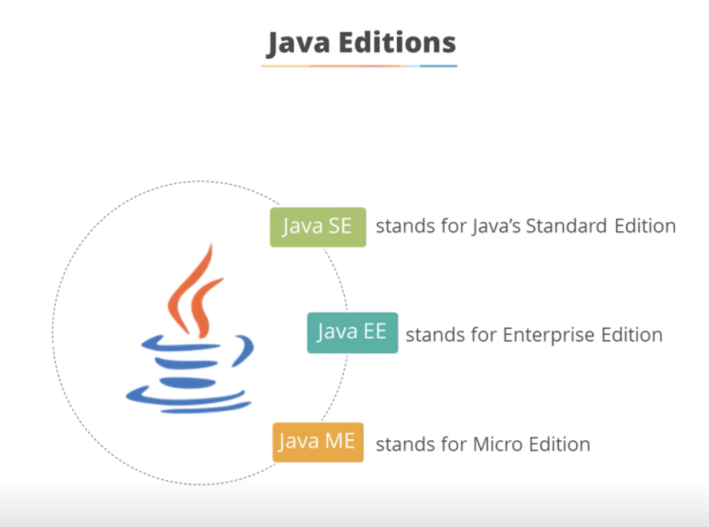

# Introduction to JAVA EE

## TOC

- [Introduction to JAVA EE](#introduction-to-java-ee)
  - [TOC](#toc)
  - [Abbreviations](#abbreviations)
  - [Introduction to Java EE](#introduction-to-java-ee-1)
    - [Java Editions](#java-editions)
      - [Features of Java SE (Standard Edition)](#features-of-java-se-standard-edition)
      - [Features of Java EE (Enterprise Edition)](#features-of-java-ee-enterprise-edition)
      - [Features of Java ME (Micro Edition)](#features-of-java-me-micro-edition)
    - [Java EE vs. Java SE](#java-ee-vs-java-se)
    - [Java EE Libraries and APIs](#java-ee-libraries-and-apis)

## Abbreviations

- \*[API]: Application Programming Interface
- \*[EE]: Enterprise Edition
- \*[JDBC]: Java Database Connectivity
- \*[JMS]: Java Message Service
- \*[JPA]: Java Presistence API
- \*[JSP]: Java Server Pages
- \*[ME]: Micro Edition
- \*[RMI]: Remote Method Invocation
- \*[SE]: Standard Edition
- \*[XML]: E**X**tensible Markup Language

## Introduction to Java EE

### Java Editions

#### Features of Java SE (Standard Edition)

- Java SE is the core Java programming platform.  It contains all Java libraries
- The latest version id **Java SE 8u131**
- It helps to develop and deploy Java applications on desktops, server, and embedded environments.  It is used to build standalone applications

#### Features of Java EE (Enterprise Edition)

- Java EE platform is designed to help developers create large-scale, multi-tiered, scalable, reliable, and secure network applications
- The latest version is **Java EE 7**
- It is portable, so it allows an application hosted at one common place to be accessed by users across the world over the Internet
- It provides API (Application Programming Inteface) to develop **distributed applications** that follows **Client-Server Model**
- If facilitates the development of web applications

#### Features of Java ME (Micro Edition)

- Java ME (Java 2 Platform, Micro Edition) is a technology that allows programmers to develop programs for mobile application devices
- The latest version is **Java ME 8.3**
- If consists of programming specifications and a special virtual machine, the K virtual machine, that allows a Java ME-encoded program to run on mobile devices

### Java EE vs. Java SE

The Java EE differs from Java SE in terms of the libraries it provides to deploy

- fault-tolerant,
- distributed, and
- multi-tier Java software, based largely on modular components running on an application server

### Java EE Libraries and APIs

- Built on top of Java SE, Java EE provides additional libraries for
  - database access [JDBC(Java Database Connectivity), JPA (Java Presistence API)]
  - remote method invocation (RMI)
  - messageing [JMS (Java Message Service)]
  - web services
  - XML (eXtensible Markup Language) processing
- It also degines standard APIs for Enterprise Javabeans, Servlets, Portlets, and Java Server Pages (JSP)
